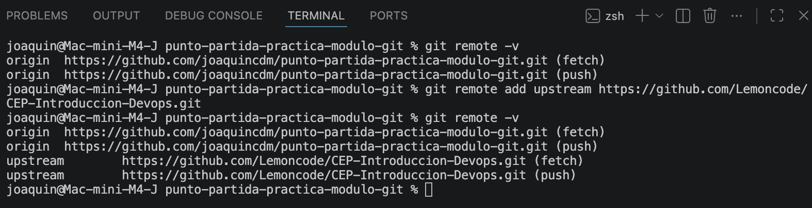
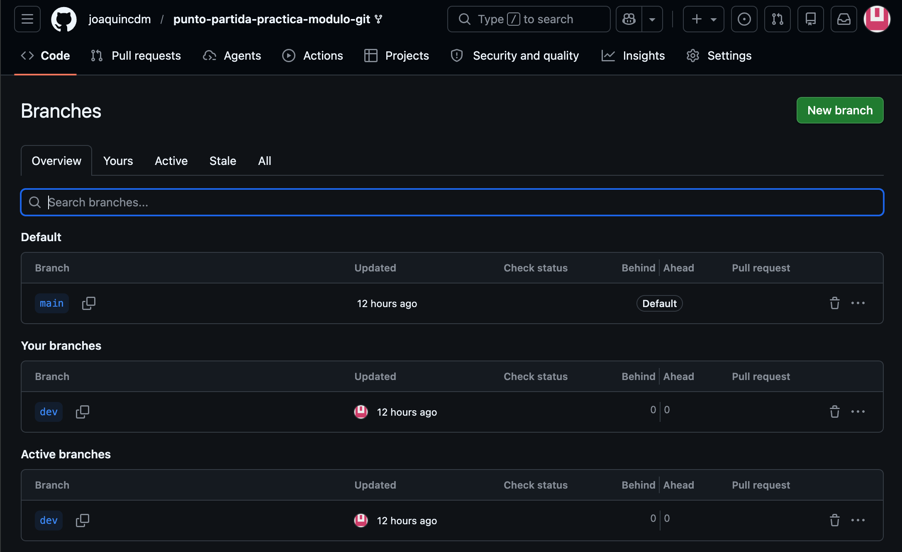
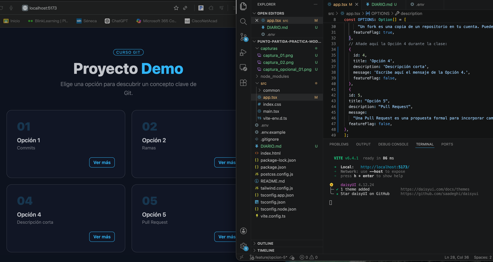
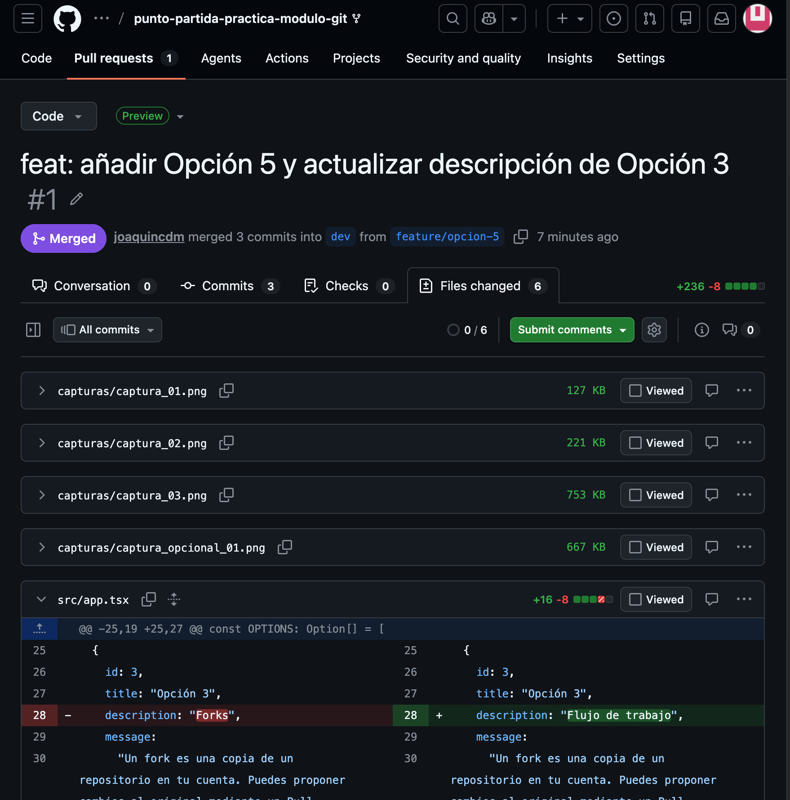
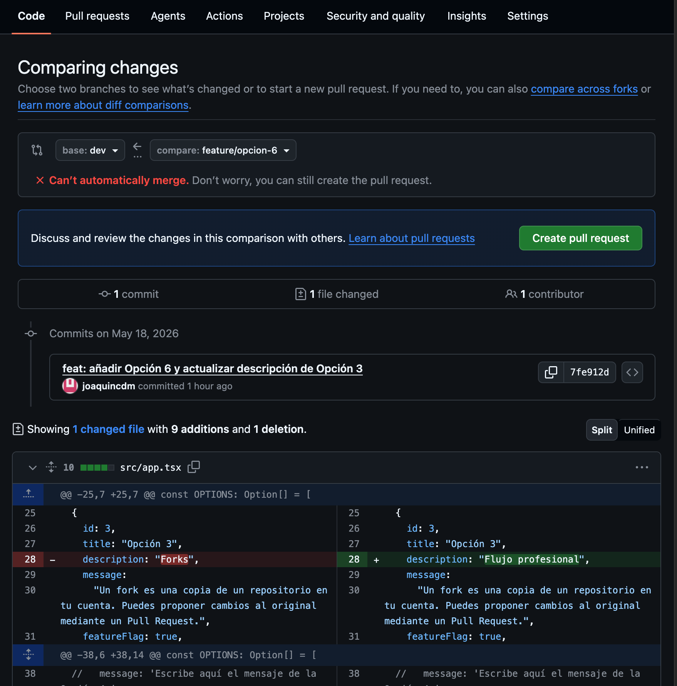
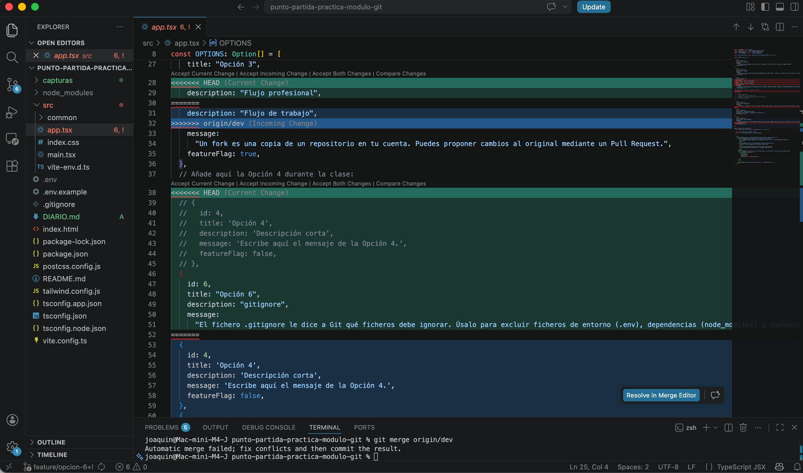
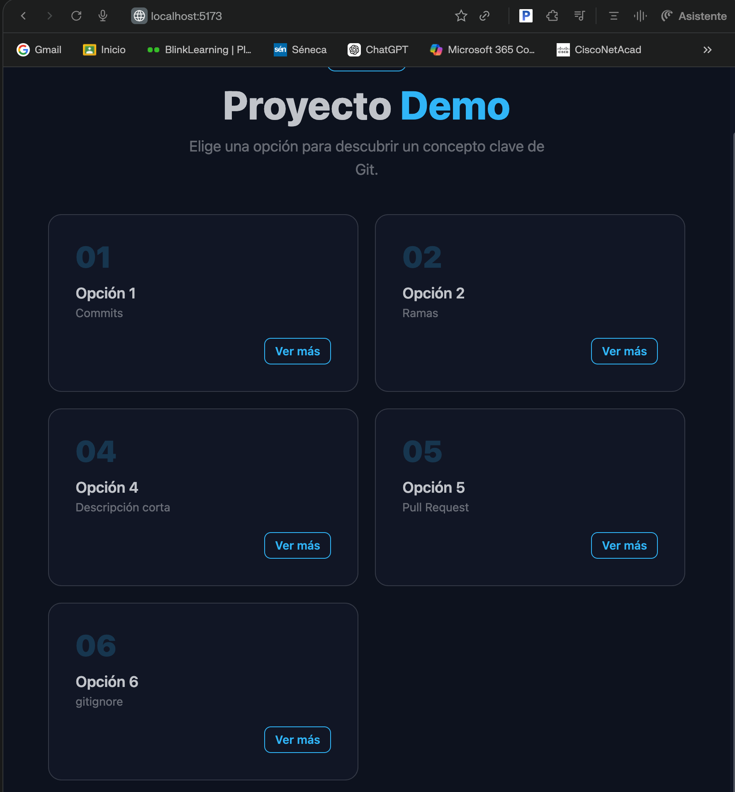
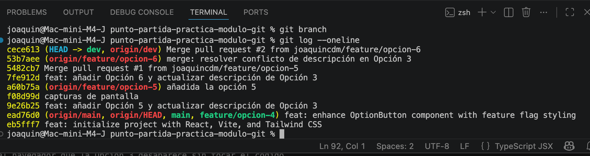
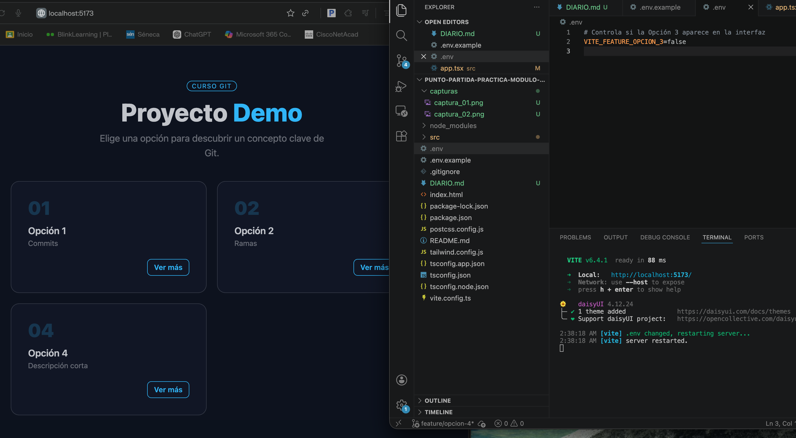

# Diario de trabajo

Este archivo contiene el trabajo de Joaquín para el curso del CEP Introducción a DevOps
### Tarea 1 — Fork y configuración inicial
> **Diario:** Escribe qué es un fork y para qué sirve `upstream`. Adjunta la captura 1 y la captura 2.

Un fork es una copia de un repositorio que no me pertenece que hago en mi propia cuenta para trabajar con él. En el caso de esta práctica he partido de un repositorio propiedad de LemonCode y he creado una copia de ese repositorio en mi propia cuenta de Github para poder trabajar libremente con él. 

El repositorio folkeado lo he clonado a mi ordenador en local. Lo hago pinchando en el botón verde “Code” y copiando la ruta url. Desde VS puedo usar la terminal y escribir “git clone [url del proyecto]”.

Abro la terminal y compruebo la versión de node con “node -v”. Luego descargo los paquetes necesarios con “npm install”. Ejecuto el proyecto de ejemplo en mi máquina. Para eso sigo las instrucciones del archivo Readme, arranco la aplicación y compruebo que funciona en el navegador.

Configuración del repositorio. Vamos a revisar la configuración con el comando: “git remote -v”. Se puede configurar el origin y el upstream. En principio sólo está el mio, pero puedo añadir el remote del repositorio original poniendole el nombre "upstream".

Para trabajar tranquilamente y hacer cambios sin modificar la rama principal, creo una rama (branch) llamada "dev". Usamos el comando “git switch -c dev”. Con este comando creamos la rama “dev” si no existe y nos movemos a esa rama. Para publicar la nueva rama a Github, desde la terminal ponemos: “git push -u origin dev”. 

- Captura 1: Terminal con `git remote -v` mostrando `origin` y `upstream` 

- Captura 2: GitHub con la rama `dev` visible en el desplegable de ramas                        |

---

### Tarea 2 — Feature branch A: añadir la Opción 5
> **Diario:** Explica por qué la rama parte de `dev` y no de `main`. Adjunta la captura 3.

Estoy usando la rama "dev" para desarrollo, en esta rama es donde se integran y prueban los cambios y nuevas funcionalidades. Cuando las nuevas funciones estén terminadas y probadas se integran a la rama principal "main".

Para subir al repositorio los cambios locales voy por pasos:
Tengo que preparar los archivos para el commit. Se usa el comando: 
“git add src/app.tsx”

Creo un commit, es decir, una versión guardada de los cambios realizados.
git commit -m "feat: añadir Opción 5 y actualizar descripción de Opción 3"

Subo mi rama feature/opcion-5 al repositorio remoto llamado origin.
El -u deja esa rama conectada al remoto para que después pueda usar git push o git pull sin escribir todo el comando.
git push -u origin feature/opcion-5

- Captura 3: La app en el navegador con la Opción 5 recién añadida 
---

### Tarea 3 — Feature branch B: añadir la Opción 6 (aquí está el conflicto)
> **Diario:** Explica qué es un conflicto en Git y por qué se va a producir aquí.

Un conflicto en Git aparece cuando dos ramas han cambiado la misma parte del mismo archivo de forma distinta, y Git no sabe automáticamente cuál de las dos versiones debe dejar. En el ejemplo:
- En feature/opcion-5 la Opción 3 cambia description a "Flujo de trabajo".
- En feature/opcion-6 la Opción 3 cambia ese mismo campo a "Flujo profesional".
- Ambas ramas salen del mismo punto en dev, así que parten del mismo valor original, pero después lo modifican de manera distinta.

Creo la rama feature/opcion-6. Para eso estoy en dev, y con el comando "git switch -c feature/opcion-6" creo la rama y me muevo a ella. Ahora trabajo en esta rama.
Añado la Opción 6 al archivo "src/app.tsx".

---

### Tarea 4 — Pull Request 1: Feature A a `dev`
> **Diario:** Explica qué revisaste en la pestaña Files changed y por qué es útil hacerlo antes de mergear. Adjunta la captura 4.

En Files changed en GitHub veo todos los archivos que se han modificado en la rama feature/opcion-5. En este caso he añadido una nueva tarjeta con la Opción 6 y he cambiado la descripción de la Opción 3. Se ve en rojo lo que se ha eliminado y en verde lo que se ha añadido.
Es útil revisarlo antes de mergear para asegurarme de que los cambios son los correctos y que no he introducido ningún error.
En este caso veo también que estoy trabajando mal con los archivos DIARIO.md y las capturas de pantalla de la tarea. Estos archivos debería haberlos dejado fuera del repositorio de Git y meterlos al final para hacer la entrega.

- Captura 4: El PR de Feature A en GitHub con la pestaña **Files changed** abierta 

---

### Tarea 5 — Pull Request 2: Feature B a `dev`, conflicto
> **Diario:** Explica qué significan los marcadores `<<<<<<<`, `=======` y `>>>>>>>` y qué criterio usaste para decidir qué versión conservar. Adjunta las capturas 5, 6 y 7.
Esos marcadores significan:
<<<<<<< HEAD: Indica el inicio del conflicto.
=======: Separa las dos versiones.
>>>>>>> feature/opcion-6: Indica el final del conflicto.

- Captura 5: El PR de Feature B en GitHub mostrando el banner rojo de conflicto 

- Captura 6: Los marcadores de conflicto (`<<<<<<<`, `=======`, `>>>>>>>`) en VS Code  

- Captura 7: La app en el navegador con todas las opciones visibles tras resolver el conflicto  
---

### Tarea 6 — Limpieza y cierre del diario
> **Diario:** Adjunta la captura 8 (`git log --oneline`). Cierra el diario con un párrafo libre: qué te ha resultado más difícil y qué tiene más sentido ahora que antes de la clase.

- Captura 8: Terminal con `git log --oneline` en `main` mostrando todos los commits  

En general la clase me ha parecido bastante interesante. He intentado hacer todos los pasos para practicar, pero he tenido algún problema con los archivos de DIARIO y las capturas de pantalla hasta que me he dado cuenta que era mejor dejar esos archivos fuera del repositorio hasta el final. He tenido que ir hacia atrás varias veces para corregir los errores. Por lo demás, todo bien después de varias horas de práctica.

---

## Tareas opcionales
---
### Opcional 1 — Feature flag
> **Diario:** Explica por qué `.env` no está en Git y para qué sirve `.env.example`.

.env no suele subirse a Git porque puede contener datos sensibles y configuración privada del entorno, como claves, contraseñas o valores distintos para cada equipo o despliegue. Sirve para que cada persona tenga su propia configuración local sin exponerla en el repositorio.

.env.example sirve como plantilla: muestra qué variables necesita el proyecto, pero sin poner los valores reales. Así, cuando alguien clona el repo, sabe qué debe copiar en su propio .env para que la app funcione.

- Captura Opcional 1: Terminal con `git remote -v` mostrando `origin` y `upstream` 

---

### Opcional 2 — PR final: `dev` a `main`
> **Diario:** Explica por qué se hace el release desde `dev` y no directamente desde una feature branch.
Se hace por seguridad, para asegurar que todos los cambios se han probado y funcionan correctamente antes de pasar a la rama principal.
---


### Capturas obligatorias

| #   | Qué debe mostrar la captura                                                       |
| --- | --------------------------------------------------------------------------------- |
| 1   | Terminal con `git remote -v` mostrando `origin` y `upstream`                      |
| 2   | GitHub con la rama `dev` visible en el desplegable de ramas                       |
| 3   | La app en el navegador con la Opción 5 recién añadida                             |
| 4   | El PR de Feature A en GitHub con la pestaña **Files changed** abierta             |
| 5   | El PR de Feature B en GitHub mostrando el banner rojo de conflicto                |
| 6   | Los marcadores de conflicto (`<<<<<<<`, `=======`, `>>>>>>>`) en VS Code          |
| 7   | La app en el navegador con todas las opciones visibles tras resolver el conflicto |
| 8   | Terminal con `git log --oneline` en `main` mostrando todos los commits     


### Tarea 1 — Fork y configuración inicial

1. Haz un fork del repositorio del instructor en tu cuenta de GitHub.
2. Clona tu fork en tu ordenador.
3. Entra en la carpeta `proyecto-demo`, instala las dependencias y arranca la app para confirmar que funciona.
4. Añade el repositorio del instructor como remote con el nombre `upstream`.
5. Verifica con `git remote -v` que tienes tanto `origin` (tu fork) como `upstream` (el instructor).
6. Crea la rama `dev` y súbela a tu fork.

> **Diario:** Escribe qué es un fork y para qué sirve `upstream`. Adjunta la captura 1 y la captura 2.

Un fork es una copia de un repositorio que no me pertenece que hago en mi propia cuenta para trabajar con él. En el caso de esta práctica he partido de un repositorio propiedad de LemonCode y he creado una copia de ese repositorio en mi propia cuenta de Github para poder trabajar libremente con él. 

El repositorio folkeado lo he clonado a mi ordenador en local. Lo hago pinchando en el botón verde “Code” y copiando la ruta url. Desde VS puedo usar la terminal y escribir “git clone [url del proyecto]”.

Abro la terminal y compruebo la versión de node con “node -v”. Luego descargo los paquetes necesarios con “npm install”. Ejecuto el proyecto de ejemplo en mi máquina. Para eso sigo las instrucciones del archivo Readme, arranco la aplicación y compruebo que funciona en el navegador.

Configuración del repositorio. Vamos a revisar la configuración con el comando: “git remote -v”. Se puede configurar el origin y el upstream. En principio sólo está el mio, pero puedo añadir el remote del repositorio original poniendole el nombre "upstream".

Para trabajar tranquilamente y hacer cambios sin modificar la rama principal, creo una rama (branch) llamada "dev". Usamos el comando “git switch -c dev”. Con este comando creamos la rama “dev” si no existe y nos movemos a esa rama. Para publicar la nueva rama a Github, desde la terminal ponemos: “git push -u origin dev”. 

- Captura 1: Terminal con `git remote -v` mostrando `origin` y `upstream` 

- Captura 2: GitHub con la rama `dev` visible en el desplegable de ramas                        |

---

### Tarea 2 — Feature branch A: añadir la Opción 5

Esta rama parte de `dev`.

1. Crea la rama `feature/opcion-5` desde `dev`.
2. Abre `src/app.tsx` y añade la siguiente tarjeta al array `OPTIONS`:

```tsx
{
  id: 5,
  title: "Opción 5",
  description: "Pull Request",
  message:
    "Una Pull Request es una propuesta formal para incorporar cambios de una rama a otra. Permite revisar el código antes de mergear y deja un historial claro de qué se hizo y por qué.",
  featureFlag: false,
},
```

3. Además, cambia el campo `description` de la **Opción 3** de su valor actual a:

```tsx
description: "Flujo de trabajo",
```

4. Arranca la app y verifica en el navegador que aparece la Opción 5.
5. Haz un commit con el mensaje: `feat: añadir Opción 5 y actualizar descripción de Opción 3`
6. Sube la rama a tu fork.

> **Diario:** Explica por qué la rama parte de `dev` y no de `main`. Adjunta la captura 3.

Estoy usando la rama "dev" para desarrollo, en esta rama es donde se integran y prueban los cambios y nuevas funcionalidades. Cuando las nuevas funciones estén terminadas y probadas se integran a la rama principal "main".

Para subir al repositorio los cambios locales voy por pasos:
Tengo que preparar los archivos para el commit. Se usa el comando: 
“git add src/app.tsx”

Creo un commit, es decir, una versión guardada de los cambios realizados.
git commit -m "feat: añadir Opción 5 y actualizar descripción de Opción 3"

Subo mi rama feature/opcion-5 al repositorio remoto llamado origin.
El -u deja esa rama conectada al remoto para que después pueda usar git push o git pull sin escribir todo el comando.
git push -u origin feature/opcion-5

- Captura 3: La app en el navegador con la Opción 5 recién añadida 
---

### Tarea 3 — Feature branch B: añadir la Opción 6 (aquí está el conflicto)

**Importante:** crea esta rama **ahora**, antes de mergear la Tarea 2. Ambas ramas deben partir del mismo punto en `dev`.

1. Vuelve a `dev` y crea la rama `feature/opcion-6` desde ahí.
2. Abre `src/app.tsx` y añade la siguiente tarjeta al array `OPTIONS`:

```tsx
{
  id: 6,
  title: "Opción 6",
  description: "gitignore",
  message:
    "El fichero .gitignore le dice a Git qué ficheros debe ignorar. Úsalo para excluir ficheros de entorno (.env), dependencias (node_modules) y cualquier cosa que no deba estar en el repositorio.",
  featureFlag: false,
},
```

3. Además, cambia el campo `description` de la **Opción 3** a:

```tsx
description: "Flujo profesional",
```

> Fíjate: la rama A cambió `description` de la Opción 3 a `"Flujo de trabajo"` y esta rama la cambia a `"Flujo profesional"`. Las dos parten del mismo valor original. Eso generará un conflicto cuando intentes mezclarlas.

4. Haz un commit con el mensaje: `feat: añadir Opción 6 y actualizar descripción de Opción 3`
5. Sube la rama a tu fork.

> **Diario:** Explica qué es un conflicto en Git y por qué se va a producir aquí.

Un conflicto en Git aparece cuando dos ramas han cambiado la misma parte del mismo archivo de forma distinta, y Git no sabe automáticamente cuál de las dos versiones debe dejar. En el ejemplo:
- En feature/opcion-5 la Opción 3 cambia description a "Flujo de trabajo".
- En feature/opcion-6 la Opción 3 cambia ese mismo campo a "Flujo profesional".
- Ambas ramas salen del mismo punto en dev, así que parten del mismo valor original, pero después lo modifican de manera distinta.

Creo la rama feature/opcion-6. Para eso estoy en dev, y con el comando "git switch -c feature/opcion-6" creo la rama y me muevo a ella. Ahora trabajo en esta rama.
Añado la Opción 6 al archivo "src/app.tsx".

---

### Tarea 4 — Pull Request 1: Feature A a `dev`

1. Abre una Pull Request en GitHub desde `feature/opcion-5` hacia `dev`.
2. Ponle como título: `feat: añadir Opción 5 y actualizar descripción de Opción 3`
3. Antes de mergear, abre la pestaña **Files changed** y revisa el diff.
4. Mergea el PR.
5. Actualiza tu rama `dev` local con `git pull origin dev`.

> **Diario:** Explica qué revisaste en la pestaña Files changed y por qué es útil hacerlo antes de mergear. Adjunta la captura 4.

En Files changed en GitHub veo todos los archivos que se han modificado en la rama feature/opcion-5. En este caso he añadido una nueva tarjeta con la Opción 6 y he cambiado la descripción de la Opción 3. Se ve en rojo lo que se ha eliminado y en verde lo que se ha añadido.
Es útil revisarlo antes de mergear para asegurarme de que los cambios son los correctos y que no he introducido ningún error.
En este caso veo también que estoy trabajando mal con los archivos DIARIO.md y las capturas de pantalla de la tarea. Estos archivos debería haberlos dejado fuera del repositorio de Git y meterlos al final para hacer la entrega.

- Captura 4: El PR de Feature A en GitHub con la pestaña **Files changed** abierta 

---

### Tarea 5 — Pull Request 2: Feature B a `dev`, conflicto

1. Abre una Pull Request desde `feature/opcion-6` hacia `dev`.
2. GitHub detectará un conflicto. No podrá mergear automáticamente.
3. Resuelve el conflicto **en local** siguiendo estos pasos:
   - Ponte en la rama `feature/opcion-6`
   - Descarga `dev` con `git fetch origin dev`
   - Fusiona con `git merge origin/dev`
   - Abre `src/app.tsx` en VS Code y localiza los marcadores de conflicto
   - Decide qué versión conservar: quédate con **`"Flujo profesional"`** (tu versión de esta rama)
   - Guarda el fichero
   - Arranca la app y verifica que se ven todas las opciones correctamente
   - Haz el commit de resolución: `merge: resolver conflicto de descripción en Opción 3`
   - Sube la rama con `git push origin feature/opcion-6`
4. Vuelve al PR en GitHub. El conflicto habrá desaparecido. Mergea el PR.
5. Actualiza tu `dev` local.

> **Diario:** Explica qué significan los marcadores `<<<<<<<`, `=======` y `>>>>>>>` y qué criterio usaste para decidir qué versión conservar. Adjunta las capturas 5, 6 y 7.
Esos marcadores significan:
<<<<<<< HEAD: Indica el inicio del conflicto.
=======: Separa las dos versiones.
>>>>>>> feature/opcion-6: Indica el final del conflicto.

- Captura 5: El PR de Feature B en GitHub mostrando el banner rojo de conflicto 

- Captura 6: Los marcadores de conflicto (`<<<<<<<`, `=======`, `>>>>>>>`) en VS Code  

- Captura 7: La app en el navegador con todas las opciones visibles tras resolver el conflicto  
---

### Tarea 6 — Limpieza y cierre del diario

1. Borra las dos feature branches en GitHub (botón **Delete branch** o desde la pestaña de ramas).
2. Bórralas también en local:

```bash
git branch -d feature/opcion-5
git branch -d feature/opcion-6
```

3. Ejecuta `git branch` y confirma que solo te quedan `main` y `dev`.
4. Asegúrate de que tu `DIARIO.md` está completo con todas las capturas y haz commit y push.

> **Diario:** Adjunta la captura 8 (`git log --oneline`). Cierra el diario con un párrafo libre: qué te ha resultado más difícil y qué tiene más sentido ahora que antes de la clase.

- Captura 8: Terminal con `git log --oneline` en `main` mostrando todos los commits  

En general la clase me ha parecido bastante interesante. He intentado hacer todos los pasos para practicar, pero he tenido algún problema con los archivos de DIARIO y las capturas de pantalla hasta que me he dado cuenta que era mejor dejar esos archivos fuera del repositorio hasta el final. He tenido que ir hacia atrás varias veces para corregir los errores. Por lo demás, todo bien después de varias horas de práctica.

---

## Tareas opcionales

---

### Opcional 1 — Feature flag

1. Abre el fichero `.env` en `proyecto-demo`.
2. Cambia `VITE_FEATURE_OPCION_3` a `false` y arranca el servidor.
3. Verifica en el navegador que la Opción 3 desaparece sin tocar el código.
4. Devuelve el valor a `true` y reinicia el servidor.

> **Diario:** Explica por qué `.env` no está en Git y para qué sirve `.env.example`.

.env no suele subirse a Git porque puede contener datos sensibles y configuración privada del entorno, como claves, contraseñas o valores distintos para cada equipo o despliegue. Sirve para que cada persona tenga su propia configuración local sin exponerla en el repositorio.

.env.example sirve como plantilla: muestra qué variables necesita el proyecto, pero sin poner los valores reales. Así, cuando alguien clona el repo, sabe qué debe copiar en su propio .env para que la app funcione.

- Captura Opcional 1: Terminal con `git remote -v` mostrando `origin` y `upstream` 

---

### Opcional 2 — PR final: `dev` a `main`

1. Abre una Pull Request desde `dev` hacia `main`.
2. Título: `release: Opciones 5 y 6 + mejoras Opción 3`
3. Revisa **Files changed** y confirma que entran todos los cambios esperados.
4. Mergea el PR.
5. Actualiza tu `main` local con `git pull origin main`.

> **Diario:** Explica por qué se hace el release desde `dev` y no directamente desde una feature branch.

---